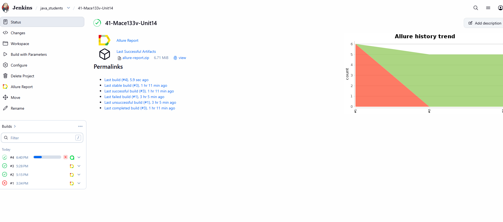
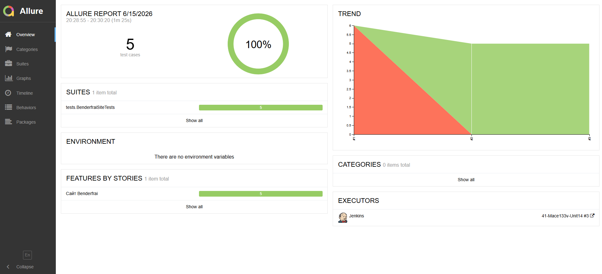
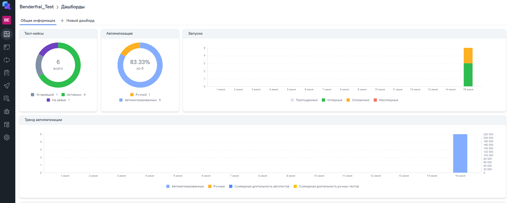
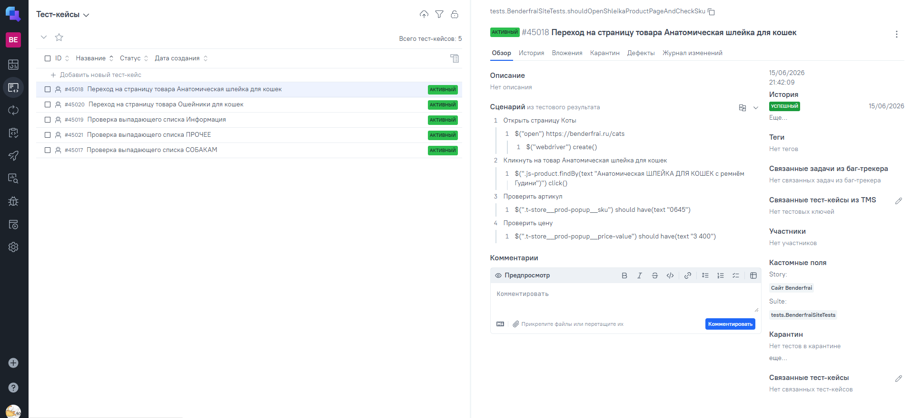
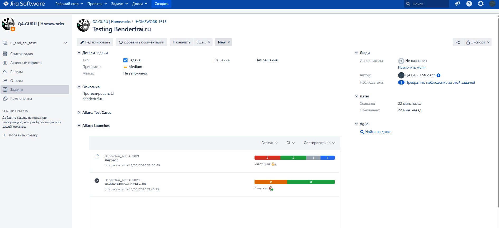
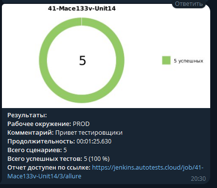
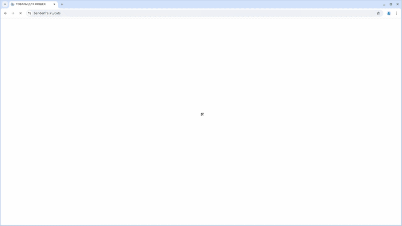

# Автоматизация тестирования сайта Benderfrai

<p align="center">
  
</p>

## :scroll: Содержание:

- [Используемый стек](#computer-используемый-стек)
- [Запуск автотестов](#arrow_forward-запуск-автотестов)
- [Сборка в Jenkins](#-сборка-в-jenkins)
- [Пример Allure-отчета](#-пример-allure-отчета)
- [Интеграция с Allure TestOps](#-интеграция-с-allure-testOps)
- [Интеграция с Jira](#-интеграция-с-jira)
- [Уведомления в Telegram](#-уведомления-в-telegram)
- [Видео примера запуска тестов в Selenoid](#-видео-примера-запуска-теста-в-selenoid)

## :computer: Используемый стек

<p align="center">
<a href="https://www.jetbrains.com/idea/"></a>
<a href="https://www.java.com/"></a>
<a href="https://selenide.org/"></a>
<a href="https://aerokube.com/selenoid/"></a>
<a href="https://docs.qameta.io/allure/"></a>
<a href="https://qameta.io/"></a>
<a href="https://gradle.org/"></a>
<a href="https://junit.org/junit5/"></a>
<a href="https://github.com/"></a>
<a href="https://www.jenkins.io/"></a>
<a href="https://telegram.org/"></a>
<a href="https://www.atlassian.com/software/jira"></a>
</p>

Тесты написаны на **Java** с использованием [Selenide](https://selenide.org/).  
Сборщик — **Gradle**, фреймворк модульного тестирования — [JUnit 5](https://junit.org/junit5/).  
Браузеры запускаются через [Selenoid](https://aerokube.com/selenoid/).  
Удалённый запуск — [Jenkins](https://www.jenkins.io/), отчёты — [Allure Report](https://docs.qameta.io/allure/).  
Результаты приходят в **Telegram** через бота.  
Настроена интеграция с [Allure TestOps](https://qameta.io/) и [Jira](https://www.atlassian.com/software/jira).

Содержание Allure-отчета:
* Шаги теста;
* Скриншот страницы на последнем шаге;
* Page Source;
* Логи браузерной консоли;
* Видео выполнения автотеста.

## :arrow_forward: Команды для запуска из терминала

### Локальный запуск:
```
gradle clean test
```
### Удалённый запуск через Jenkins:
```
clean test
-Dbrowser=$BROWSER
-DbrowserVersion=$BROWSER_VERSION 
-Denvironment=$ENVIRONMENT
-Dheadless=$HEADLESS
-DbrowserSize=$BROWSER_RESOLUTION
-DbaseUrl=$TEST_SITE_BASE_URL
-DremoteBrowserUrlLogin=$REMOTE_BROWSER_URL_LOGIN
-DremoteBrowserUrlPassword=$REMOTE_BROWSER_URL_PASSWORD
-DremoteBrowserUrl=$REMOTE_BROWSER_URL
```
При выполнении данной команды в терминале IDE тесты запустятся удаленно в <code>Selenoid</code>. 


##  Сборка в Jenkins

Для запуска сборки необходимо перейти в раздел <code>Собрать с параметрами</code> и нажать кнопку <code>Собрать</code>.
<p align="center">

</p>
После выполнения сборки, в блоке <code>История сборок</code> напротив номера сборки появятся значки <code>Allure Report</code> и <code>Allure TestOps</code>, при клике на которые откроется страница с сформированным html-отчетом и тестовой документацией соответственно.

##  Пример Allure-отчета
### Overview

<p align="center">

</p>

##  Интеграция с Allure TestOps

На *Dashboard* в <code>Allure TestOps</code> видна статистика количества тестов: сколько из них добавлены и проходятся вручную, сколько автоматизированы. Новые тесты, а так же результаты прогона приходят по интеграции при каждом запуске сборки.

<p align="center">

</p>

### Результат выполнения автотеста

<p align="center">

</p>

##  Интеграция с Jira

Реализована интеграция <code>Allure TestOps</code> с <code>Jira</code>, в тикете отображается, какие тест-кейсы были написаны в рамках задачи и результат их прогона.

<p align="center">

</p>

###  Уведомления в Telegram с использованием бота

После завершения сборки специальный бот, созданный в <code>Telegram</code>, автоматически обрабатывает и отправляет сообщение с отчетом о прогоне тестов.

<p align="center">

</p>

###  Видео примера запуска тестов в Selenoid

В отчетах Allure для каждого теста прикреплен не только скриншот, но и видео прохождения теста
<p align="center">
  
</p>
